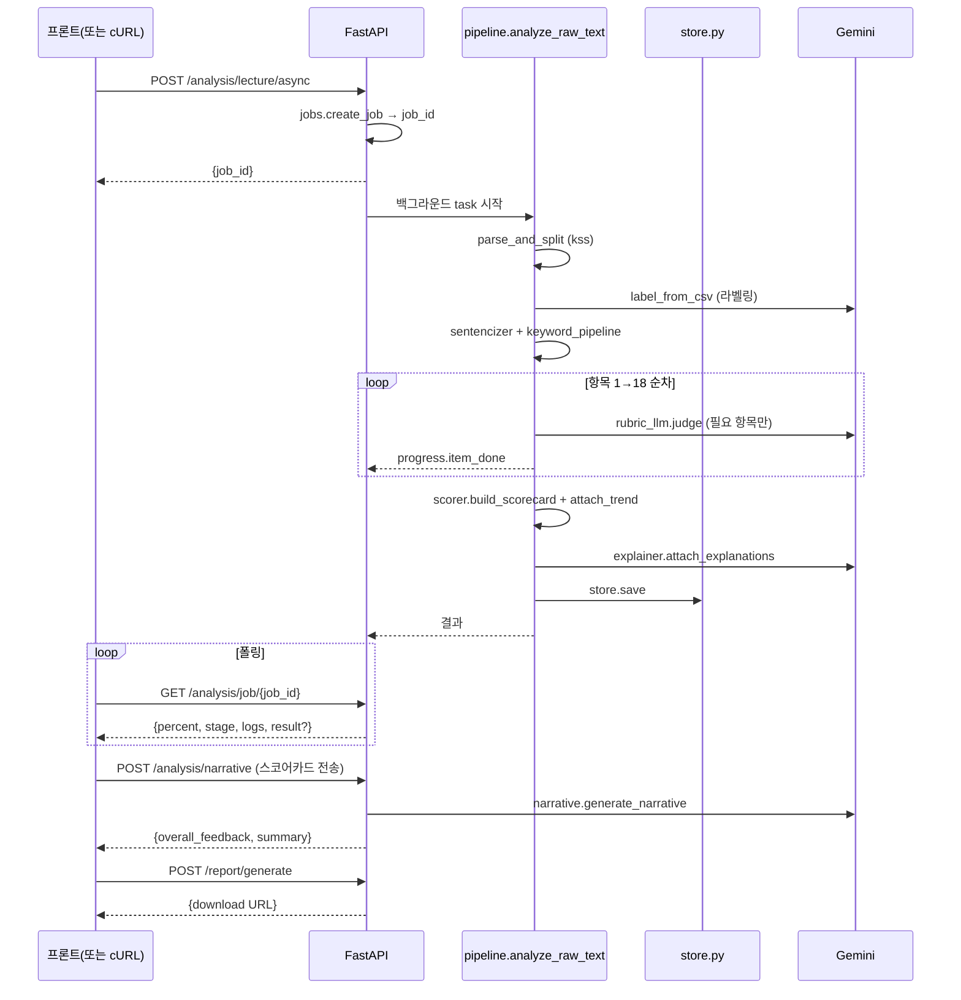

# LectureInsight Backend (v2)

> 강의 녹취록을 분석해 **18가지 강의력 항목별 점수 + 종합 해설 + 다운로드 가능한 리포트** 를 자동으로 생성하는 백엔드 엔진.

---

## 1. 이 시스템이 하는 일 (한눈에)

강사 한 사람의 강의 녹취록(STT 텍스트 파일)을 받아 **강의력의 18가지 측면**을 채점하고, **사람이 읽기 쉬운 코칭 형태의 리포트**를 만들어 줍니다.

```
강의 녹취록(.txt)  →  18개 항목 채점  →  종합 점수 · 카테고리별 점수 · 자연어 해설  →  HTML / DOCX 리포트
```

채점은 단순 키워드 카운트가 아니라
**규칙 기반 분석(시간/문장 구조/정량 지표) + Google Gemini 기반 의미 분석** 을 항목 성격에 맞게 조합합니다.
강사 누적 분석(여러 강의)으로 **점수 추이(향상·유지·하락)** 도 자동 판별합니다.

---

## 2. 사용자가 보는 흐름

```
┌────────────────────┐    ┌───────────────────────────────┐    ┌────────────────────┐
│ 1. 강의 텍스트 업로드│ →  │ 2. 분석 진행률 표시              │ → │ 3. 결과 화면        │
│  (또는 코스 ID 지정) │    │   8% 전처리 → 16% 라벨링         │    │  • 종합 점수 5점만점 │
│                    │    │   → 16~92% 항목별 채점 → 100%   │    │  • 카테고리별 점수   │
│                    │    │                              │    │  • 18 항목 상세      │
└────────────────────┘    └───────────────────────────────┘    │  • 자연어 종합 해설  │
                                                              │  • 리포트 다운로드    │
                                                              │    (HTML / DOCX)    │
                                                              └────────────────────┘
```

분석 한 건은 보통 **수십 초~수 분**이 걸립니다 (강의 길이·Gemini 응답 속도에 따라).
프론트엔드는 **백그라운드 분석**을 시작한 뒤 진행률을 폴링하므로, 창을 두고 다른 작업을 해도 됩니다.

---

## 3. 무엇을 평가하나 — 18개 강의력 항목

5개 **카테고리** 로 묶이고, 카테고리마다 **종합 점수에 기여하는 비중(가중치)** 이 다릅니다.

| 카테고리 | 가중치 | 평가 항목 |
|---|---|---|
| **강의 도입 및 구조** | 25% | 학습 목표 안내 · 전날 복습 연계 · 설명 순서 · 핵심 강조 · 마무리 요약 |
| **개념 설명 명확성** | 25% | 개념 정의 · 비유/예시 활용 · 선행 개념 확인 · 발화 속도 적절성 |
| **예시 및 실습 연계** | 20% | 예시 적절성 · 실습 연계 · 오류 대응 |
| **언어 표현 품질** | 15% | 불필요한 반복 표현 · 발화 완결성 · 언어 일관성 |
| **수강생 상호작용** | 15% | 이해 확인 질문 · 참여 유도 · 질문 응답 충분성 |

각 항목은 **1~5점**, 0.01 단위로 채점됩니다. 카테고리 평균 → 가중 평균 → **종합 점수** 가 산출됩니다.

---

## 4. 채점이 어떻게 이루어지나

항목 성격에 따라 **두 가지 방식** 을 섞어 씁니다.

| 방식 | 어떤 항목? | 작동 원리 |
|---|---|---|
| **규칙 기반 정량 분석** | 발화 속도, 발화 완결성, 언어 일관성, 이해 확인 질문 등 | 시간 간격·문장 종결어미·키워드 빈도 등 **객관 지표** 로 직접 점수 산출 |
| **LLM 의미 분석 (Gemini)** | 학습 목표 안내, 개념 정의, 예시 적절성, 오류 대응 등 | 강의의 해당 구간을 추출해 **루브릭(채점 기준)과 함께 Gemini에 질의** → JSON 점수 응답 파싱 |

두 방식 모두 거친 **점수 + 근거** 가 표현 레이어로 흘러가고, 별도의 LLM 호출 한 번이 그 결과를 **사람이 읽는 자연어 해설**(강점·개선점·종합 평가) 로 풀어 씁니다. 점수와 해설이 분리돼 있어 **재현성과 사용자 친화성**이 동시에 유지됩니다.

---

## 5. 기술 스택

| 영역 | 사용 기술 |
|---|---|
| **API 서버** | FastAPI (REST), uvicorn |
| **프론트엔드** | Next.js 15 (React 19, SWR, Recharts, Tailwind) — `frontend/` 별도 레포 |
| **LLM** | Google Gemini (`gemini-2.5-flash`, `temperature=0.2`, JSON 강제) |
| **한국어 NLP** | KSS(공용 문장 분리), Kiwi(`kiwipiepy` — 문장 분리 + EF/EC 완결성), KeyBERT(항목 7 키워드), 정규식 |
| **데이터 처리** | pandas, numpy, pydantic v2 |
| **동시성/내구성** | asyncio + Semaphore (Gemini 동시성), 백그라운드 작업 + 폴링 |
| **시각화/리포트** | matplotlib, plotly, Jinja2(HTML), python-docx(DOCX) |
| **영속화** | 파일 시스템 JSON (`data/processed/scorecards/`) — DB 미도입 |
| **로깅** | loguru |

---

## 6. 실행 방법 — 조원/사용자용 가이드

> 권장: **Conda 전용 환경**. `mecab` · `sentence-transformers` 는 **선택**(없어도 폴백/스킵으로 동작).
> 필수 준비물: Gemini API 키 1개(`.env` 의 `API_KEY`).

### 6-1. 백엔드 실행

```bash
# 1) 전용 conda 환경
conda create -n lectureinsight python=3.11 -y
conda activate lectureinsight

# 2) 의존성 설치 (editable)
cd backend
pip install -e .                  # 기본 — KSS=pecab 폴백, item14(KR-SBERT) 자동 스킵
# pip install -e ".[embeddings]"  # 선택 — 항목 14 (실습 연계) 채점까지 활성화 (torch 동반, 무거움)

# 3) 환경 변수 / 외부 경로 (선택)
cp .env.example .env                                # API_KEY(Gemini) 입력
cp configs/paths.example.yaml configs/paths.yaml    # (선택) 외부 STT 파일 경로 지정

# 4) API 서버 실행
uvicorn app.main:app --reload --port 8000 --no-access-log
#   확인: http://localhost:8000/health 가 {"status":"ok"} 면 OK
#   (--no-access-log : 프론트 폴링 GET 로그가 도배되는 것 방지)
```

### 6-2. (선택) KSS 문장 분리 속도 향상 — mecab

긴 강의는 기본 백엔드 `pecab`(순수 파이썬)이 느립니다(분 단위). mecab을 깔면 초 단위로 빨라집니다.

```bash
brew install mecab-ko mecab-ko-dic        # 충돌 시: brew unlink mecab 후 재시도
pip install mecab-python3
# Apple Silicon konlpy/mecab 경로 문제 → env 에 MECABRC 박아두기
conda env config vars set MECABRC=/opt/homebrew/etc/mecabrc -n lectureinsight
conda deactivate && conda activate lectureinsight   # 재활성화로 적용
```

미설치 시 자동으로 pecab 폴백(동작은 정상, 느릴 뿐).
**OS 의존이라 `pip install -e .` 만으론 재현 안 됨** — 머신마다 위 단계 필요.

### 6-3. 프론트엔드 실행 (별도 터미널)

```bash
cd frontend
npm install
cp .env.example .env.local        # NEXT_PUBLIC_API_BASE_URL=http://localhost:8000
npm run dev                       # → http://localhost:3000
```

### 6-4. CLI 단독 실행 (FastAPI 없이 파이프라인만)

분석 결과를 콘솔에 바로 출력하고 싶을 때:

```bash
python -m app.analysis.pipeline data/raw/2026-02-02_kdt-backendj-21th.txt -c 5
#   -c, --concurrency : Gemini 동시 요청 수 (무료 티어는 1 권장)
```

### 6-5. 동작 확인 — 빠른 스모크 테스트

```bash
# 1) 서버 떴는지
curl -s http://localhost:8000/health
#   → {"status":"ok"}

# 2) 강의 1편 동기 분석 (시간이 오래 걸리므로 짧은 텍스트 권장)
curl -X POST http://localhost:8000/api/v1/analysis/lecture \
  -H "Content-Type: application/json" \
  -d '{"instructor_id":"demo","lecture_date":"2026-02-02","course_id":"kdt-backendj-21th"}'

# 3) 백그라운드(권장) — job_id 받아 진행률 폴링
curl -X POST http://localhost:8000/api/v1/analysis/lecture/async -H "Content-Type: application/json" \
  -d '{"instructor_id":"demo","lecture_date":"2026-02-02","course_id":"kdt-backendj-21th"}'
# 응답: {"job_id":"abc123..."}

curl http://localhost:8000/api/v1/analysis/job/abc123...
#   → {percent, stage, completed/total, logs[], result?}
```

---

## 7. Architecture — 내부 흐름 (개발자용)

### 7-1. 한 번 들어온 강의가 거치는 5단계

```
┌──────────────────────────────────────────────────────────────────────────────┐
│ 입력: STT 텍스트 (raw_text 직접 또는 paths.yaml + course_id 로 외부 파일)        │
└──────────────────────────────────┬───────────────────────────────────────────┘
                                   │
        ┌──────────────────────────▼──────────────────────────┐
        │ ① 공유 입력 준비 (강의당 1회)                          │
        │  utils.parse_and_split  → kss        (KSS 문장 분리)   │
        │  utils.label_from_csv   → labeled    (개념/예시/실습)  │
        │  sentencizer.build_*    → sentences  (Kiwi+완결성)     │
        │  item07_keyword_pipeline → keywords.json (KeyBERT)    │
        └──────────────────────────┬──────────────────────────┘
                                   │
        ┌──────────────────────────▼──────────────────────────┐
        │ ② 18개 항목 채점 (1→18 순차, Gemini rate-limit 보호)   │
        │  각 항목 모듈은 4가지 입력 중 하나를 받아 점수+근거 반환  │
        │  pipeline._ITEMS 가 18개 항목을 한 곳에서 등록·실행      │
        └──────────────────────────┬──────────────────────────┘
                                   │ details(점수+근거) · chunk(부가)
        ┌──────────────────────────▼──────────────────────────┐
        │ ③ 스코어카드 만들기 (scorer)                          │
        │  카테고리별 평균 → 가중 평균 → 종합 점수              │
        │  누적 이력으로 선형 회귀 → 트렌드(향상/유지/하락)       │
        └──────────────────────────┬──────────────────────────┘
                                   │ InstructorScorecard
        ┌──────────────────────────▼──────────────────────────┐
        │ ④ 자연어 해설 부착 (explainer, Gemini 1회)             │
        │  각 항목의 grounds·reason·strengths·improvements    │
        │  를 사람이 읽기 쉬운 코칭 문장으로 채움                 │
        └──────────────────────────┬──────────────────────────┘
                                   │
        ┌──────────────────────────▼──────────────────────────┐
        │ ⑤ 영속화 + 응답 (store.save → JSON)                  │
        │  data/processed/scorecards/{instructor}/{date}.json │
        └──────────────────────────┬──────────────────────────┘
                                   │
                  JSON 응답  /  리포트 생성(`/report/generate`)
                              · Next.js 프론트 — `narrative` 호출로 종합 해설 추가
```

### 7-2. API 시퀀스 (Mermaid)



### 7-3. preprocessing vs analysis 책임 경계

| 디렉토리 | 책임 | 비유 |
|---|---|---|
| **preprocessing/** | ① 강의 텍스트 가공의 **공통 인프라**(파싱·문장분리·라벨링·시간축). ② 항목별 **데이터 가공** + LLM 없이 채점 가능한 항목은 **직접 score 산출**. | "재료 손질" |
| **analysis/** | ① **LLM 호출 추상화**(`rubric_llm` `analyzer`). ② 항목별 **LLM 채점 진입점**(같은 이름의 preprocessing 모듈에서 청크를 받고 Gemini 채점). ③ **파이프라인 오케스트레이션**(`pipeline.py`)·점수 집계(`scorer.py`)·표현 레이어(`explainer.py` `narrative.py`). | "요리·플레이팅" |

> 같은 항목이 두 디렉토리에 동시에 존재할 수 있습니다 — 예: `preprocessing/item04_learning_objectives.py` 가 도입부 30분 청크 생성 → `analysis/item04_learning_objectives.py` 가 Gemini 호출·채점.

### 7-4. 4가지 공유 입력 (`pipeline._ITEMS` 의 두 번째 컬럼)

```
┌─────────┬───────────────────────────────────────────────────────────────────┐
│  kss    │ KSS 문장 분리 결과 DataFrame (timestamp·elapsed_sec·text 등)        │
│         │ → 학습목표/복습연계/마무리/발화속도/이해확인/참여유도/질문응답          │
├─────────┼───────────────────────────────────────────────────────────────────┤
│ labeled │ 개념/예시/실습으로 라벨링된 청크 DataFrame (Gemini 1회 호출 결과)      │
│         │ → 설명순서/개념정의/비유예시/예시적절성/실습연계/오류대응               │
├─────────┼───────────────────────────────────────────────────────────────────┤
│sentences│ Kiwi 문장화 결과(완결성·EF/EC 태그 포함)                              │
│         │ → 발화완결성/언어일관성                                              │
├─────────┼───────────────────────────────────────────────────────────────────┤
│txt_path │ 원본 STT 텍스트 파일 경로 (모듈 내부에서 직접 파싱)                    │
│         │ → 반복표현/핵심강조/선행개념 확인                                     │
└─────────┴───────────────────────────────────────────────────────────────────┘
```

### 7-5. 비동기 ↔ 순차 — 의도된 설계 변경

> 초기 v2 설계는 `asyncio.gather` 로 **18개 항목 병렬** 이었지만, 현재는 **항목 1→18 순차 실행** 입니다.

이유:
- Gemini 무료 티어의 **분당 요청 제한**을 안정적으로 통과
- 진행률 표시·로그 순서 보장
- 디버깅 시 어떤 항목이 느린지 직관적으로 보임

다만 **각 항목 내부의 청크 단위 호출은 여전히 비동기**(Semaphore 로 동시성 제어) 입니다 — 그래서 충분히 빠릅니다.

---

## 8. REST API

베이스: `/api/v1`

### 분석

| 메서드 | 경로 | 용도 |
|---|---|---|
| POST | `/analysis/lecture` | **동기** 단일 강의 분석. 분석이 끝나면 `InstructorScorecard` JSON 응답 |
| POST | `/analysis/lecture/async` | **비동기** 분석 시작 → `{job_id}` 즉시 반환 |
| GET | `/analysis/job/{job_id}` | 작업 상태 폴링 (`status / percent / stage / logs / result`) |
| POST | `/analysis/batch` | 다중 강의 일괄 분석 (강사 누적 트렌드용) |
| POST | `/analysis/narrative` | 스코어카드 → 종합 자연어 해설(`overall_feedback` + `summary`) |
| GET | `/analysis/instructor/{instructor_id}` | 강사 누적 분석 + 트렌드 + 주차 집계 |

### 리포트

| 메서드 | 경로 | 용도 |
|---|---|---|
| POST | `/report/generate` | 스코어카드 → HTML/DOCX 생성, 다운로드 URL 반환 |
| GET | `/report/download/{file_id}` | 파일 다운로드 (`{instructor}__{date}__{fmt}`) |

### 헬스체크

| GET | `/health` | `{"status":"ok"}` |

### 요청 페이로드 예 (`/analysis/lecture/async`)

```jsonc
{
  "instructor_id": "instructor_01",
  "lecture_date": "2026-02-02",        // YYYY-MM-DD
  // 아래 둘 중 하나는 필수
  "course_id": "kdt-backendj-21th",     // paths.yaml 의 stt_dir 에서 파일 로드
  "raw_text": "<09:11:17> id: ..."     // STT 원문을 직접 전달
}
```

### 진행률 응답 예 (`/analysis/job/{job_id}`)

```jsonc
{
  "job_id": "abc123...",
  "status": "running",       // pending | running | done | error
  "percent": 48.6,
  "stage": "평가 항목 18개 분석 중…",
  "completed": 7,
  "total": 18,
  "logs": [
    {"ts":"14:21:03","level":"info","message":"[1/18] repetition 채점 완료 (점수 4.2)"}
  ],
  "result": null              // status=done 이 되면 여기에 InstructorScorecard
}
```

---

## 9. Project Layout

```
backend/
├── app/
│   ├── api/routes/
│   │   ├── analysis.py            # /lecture (sync/async), /job, /batch, /narrative, /instructor
│   │   ├── report.py              # /generate, /download
│   │   └── health.py
│   ├── core/
│   │   ├── config.py              # Pydantic Settings (.env)
│   │   ├── checklist.py           # 18 항목 메타 로더 (configs/checklist.yaml)
│   │   ├── paths.py               # configs/paths.yaml — 외부 STT 위치
│   │   ├── store.py               # 스코어카드 JSON 영속화 (DB 도입 전)
│   │   └── jobs.py                # 백그라운드 작업 + ProgressSink
│   ├── preprocessing/
│   │   ├── utils.py               # ★ 공통: parse_and_split, label_from_csv, 시간축, 키워드/윈도우
│   │   ├── sentencizer.py         # Kiwi 문장화 + EF/EC 완결성
│   │   ├── preprocessor.py        # (보조) STT 파싱
│   │   ├── eda.py                 # 보조 통계
│   │   ├── item02_completeness.py
│   │   ├── item03_consistency.py
│   │   ├── item04_learning_objectives.py
│   │   ├── item05_review_linkage.py
│   │   ├── item06_sequence_violation.py
│   │   ├── item07_keyword_pipeline.py / item07_noun_extractor.py   # 항목 7 키워드(KeyBERT)
│   │   ├── item08_summary.py
│   │   ├── item09_concept_definition.py
│   │   ├── item10_example_coverage.py
│   │   ├── item12_pace.py
│   │   ├── item13_example_relevance.py
│   │   ├── item15_error_handling.py
│   │   ├── item16_comprehension_check.py
│   │   ├── item17_engagement.py
│   │   └── item18_question.py
│   ├── analysis/
│   │   ├── pipeline.py            # ★ 18 항목 오케스트레이터 (_ITEMS 레지스트리)
│   │   ├── rubric_llm.py          # Gemini 호출 + 항목 YAML 프롬프트 로더
│   │   ├── rubrics.py             # configs/item_rubrics.yaml 로더 (해설용)
│   │   ├── analyzer.py            # LLM 게이트웨이: _call_llm (explainer/narrative 공유) + 캐싱·재시도
│   │   ├── explainer.py           # 항목별 자연어 해설 (grounds/reason/strengths/improvements)
│   │   ├── narrative.py           # 종합 해설(overall_feedback) + 요약(summary)
│   │   ├── scorer.py              # 카테고리 가중 평균 + 트렌드 + 주차 집계
│   │   ├── schemas.py             # Utterance / Sentence / InstructorScorecard / ItemScore
│   │   ├── embedder.py            # ★ KR-SBERT 임베딩 유틸 (item11·item14 가 사용) — 사용 중
│   │   ├── templates.py           # load_item_prompt — 항목 프롬프트 YAML 로더 (item14 가 사용)
│   │   ├── emphasis_checker.py    # item07 강조 판정 보조
│   │   ├── item01_repetition.py
│   │   ├── item04_learning_objectives.py
│   │   ├── item05_review_linkage.py
│   │   ├── item06_sequence_violation.py
│   │   ├── item07_emphasis.py
│   │   ├── item08_summary.py
│   │   ├── item09_concept_definition.py
│   │   ├── item10_example_coverage.py
│   │   ├── item11_prerequisite.py
│   │   ├── item13_example_relevance.py
│   │   ├── item14_practice_link.py
│   │   ├── item15_error_handling.py
│   │   ├── item18_question.py
│   │   └── prompts/items/         # 항목 LLM 프롬프트 (item04~item18 + README.md)
│   ├── report/
│   │   ├── report_generator.py    # OUTPUT_ROOT, generate(scorecard, formats)
│   │   ├── charts.py              # 레이더 / 추이 차트
│   │   ├── html.py                # Jinja2
│   │   └── docx.py                # python-docx
│   ├── main.py                    # FastAPI 부트스트랩
│   ├── models/ / utils/           # placeholder
├── configs/
│   ├── checklist.yaml             # 18 항목 메타 + 카테고리 가중치 + 구간 분리
│   ├── item_rubrics.yaml          # 항목별 채점 기준(criterion/high/low/caveat) — explainer·narrative 주입용
│   ├── kiwi_user_dict.yaml        # Kiwi 사용자 사전
│   ├── paths.example.yaml         # paths.yaml 템플릿
│   └── paths.yaml                 # ★ 외부 STT 경로 (gitignore 권장)
├── data/                          # 원본/처리 데이터 (gitignore)
│   ├── raw/                       # STT 원본 .txt
│   └── processed/
│       ├── *_kss.csv              # parse_and_split 결과 (문장 분리)
│       ├── *_labeled.json         # label_from_csv 결과 (개념/예시/실습 청크)
│       └── scorecards/            # store.py 가 저장한 InstructorScorecard
├── outputs/                       # 생성 리포트 (gitignore)
├── notebooks/                     # 항목별 EDA·라벨 검토
├── tests/                         # 항목별 단위 테스트
├── pyproject.toml
└── .env.example
```

---

## 10. 18 항목 구현 위치 (개발자용 색인)

각 항목이 **어디서 데이터를 받고**(입력), **어디서 채점되는지**(채점 모듈) 입니다.

| ID | 항목 | 카테고리 | 입력 | 채점 모듈 | 채점 방식 |
|---|---|---|---|---|---|
| 1 | 불필요한 반복 표현 | language | `txt_path` | `analysis/item01_repetition` | 규칙 + LLM |
| 2 | 발화 완결성 | language | `sentences` | `preprocessing/item02_completeness` | 정량(EF/EC) |
| 3 | 언어 일관성 | language | `sentences` | `preprocessing/item03_consistency` | 정량 |
| 4 | 학습 목표 안내 | structure | `kss` | `analysis/item04_learning_objectives` | LLM (intro 30분) |
| 5 | 전날 복습 연계 | structure | `kss` | `analysis/item05_review_linkage` | LLM |
| 6 | 설명 순서 | structure | `labeled` | `analysis/item06_sequence_violation` | 규칙(labeled 청크) |
| 7 | 핵심 강조 | structure | `txt_path` | `analysis/item07_emphasis` | KeyBERT 키워드 + 강조 신호 |
| 8 | 마무리 요약 | structure | `kss` | `analysis/item08_summary` | LLM |
| 9 | 개념 정의 | concept | `labeled` | `analysis/item09_concept_definition` | LLM |
| 10 | 비유/예시 활용 | concept | `labeled` | `analysis/item10_example_coverage` | LLM |
| 11 | 선행 개념 확인 | concept | `txt_path` | `analysis/item11_prerequisite` | LLM |
| 12 | 발화 속도 적절성 | concept | `kss` | `preprocessing/item12_pace` | 정량(duration_sec) |
| 13 | 예시 적절성 | practice | `labeled` | `analysis/item13_example_relevance` | LLM |
| 14 | 실습 연계 | practice | `labeled` | `analysis/item14_practice_link` | LLM (+옵션 KR-SBERT) |
| 15 | 오류 대응 | practice | `labeled` | `analysis/item15_error_handling` | LLM |
| 16 | 이해 확인 질문 | interaction | `kss` | `preprocessing/item16_comprehension_check` | 정량(키워드+규칙) |
| 17 | 참여 유도 | interaction | `kss` | `preprocessing/item17_engagement` | 정량 |
| 18 | 질문 응답 충분성 | interaction | `kss` | `analysis/item18_question` | LLM (Q-A 페어) |

`preprocessing/itemNN_*.py` 가 **채점까지** 하는 항목은 LLM 없이 객관 지표로 산출되는 항목입니다.
나머지(`analysis/itemNN_*.py`)는 preprocessing 의 동일 이름 모듈을 호출해 청크를 받고 Gemini 로 채점합니다.

---

## 11. 새 평가 항목 추가하기

1. `app/preprocessing/itemNN_<name>.py` 작성
   - LLM 없이 채점 가능 → `run(df) -> {"final_score": float, "reason": str, "evidence": [...] | None}`
   - LLM 필요 → `run(df) -> {"chunk": str}` (또는 그에 준하는 LLM 입력)
2. LLM 채점이 필요하면 `app/analysis/itemNN_<name>.py` 작성
   - preprocessing 의 `run(df)` 으로 청크 받고 `rubric_llm.judge()` 호출
   - 결과는 `rubric_llm.build(final_score, reason, evidence, mode)` 로 통일된 형식 반환
3. 항목 LLM 프롬프트가 필요하면 `app/analysis/prompts/items/itemNN_<name>.yaml` 추가 (`system`, `user_template`, `{chunk}` 치환자)
4. `app/analysis/pipeline.py:_ITEMS` 에 한 줄:
   ```python
   ("<key>", <module>.<run_fn>, "kss"|"labeled"|"sentences"|"txt_path", "score"|"chunk"),
   ```
   그리고 `_KEY_TO_ID` 에 `(key, item_id)` 매핑 추가
5. `configs/checklist.yaml` 의 18 항목 메타와 동기화
6. `configs/item_rubrics.yaml` 에 항목 루브릭(`criterion / high / low / caveat`) 추가 — 해설 품질을 위해 강력 권장

---

## 12. 환경 변수

`.env.example` 참고. 주요 변수만:

```ini
# Gemini
API_KEY=...
LLM_MODEL=gemini-2.5-flash
LLM_TEMPERATURE=0.2
LLM_CONCURRENCY=10                # 무료 티어면 1, 유료면 5~10

# 서버
APP_HOST=0.0.0.0                  # uvicorn 바인드
APP_PORT=8000

# CORS (Next.js 프론트 허용)
CORS_ORIGINS=http://localhost:3000
```

> 프론트엔드(Next.js, `frontend/`)는 API 주소를 자체 `NEXT_PUBLIC_API_BASE_URL` 로 지정합니다.

---

## 13. 외부 데이터 경로 (`configs/paths.yaml`)

실 강의 데이터는 보안상 repo 밖에 두고 경로만 참조합니다.

```yaml
data:
  stt_dir: /절대/경로/to/stt
  metadata_csv: /절대/경로/to/metadata.csv
stt_filename_pattern: "{date}_{course_id}.txt"
```

`/analysis/lecture` 호출 시 `course_id` 를 주면 위 경로에서 `{date}_{course_id}.txt` 를 읽어 들입니다.

---

## 14. 영속화

DB 도입 전 단계로, 분석 결과를 **파일 시스템 JSON** 으로 저장합니다.

```
data/processed/scorecards/{instructor_id}/{lecture_date}.json
```

- `store.save(scorecard)` 가 저장 (재호출 시 덮어쓰기)
- `store.list_by_instructor(...)` 가 폴더 글로브 + 정렬로 누적 이력 반환
- 강사 트렌드(선형 회귀)는 이 누적 이력으로 매 분석 후 갱신

> 데이터 규모가 커지거나 검색이 필요해지면 PostgreSQL 등으로 마이그레이션할 시점입니다.

---

## 15. 보안 / 운영 메모

- 실 강의 데이터는 **절대 커밋 금지** (`data/`, `outputs/`, `configs/paths.yaml` 모두 gitignore)
- API 키는 `.env` 로만 관리, 코드 하드코딩 금지
- Gemini thinking-token 이 `max_output_tokens` 를 잠식하므로 출력 토큰 한도를 두지 않음 (`rubric_llm.judge` 주석 참조)
- LLM 호출 동시성은 `concurrency` / `LLM_CONCURRENCY` 로 제어 — 무료 티어는 `1`, 유료라도 분당 한도를 보고 조정
- 한 항목이 실패해도 **전체 분석은 계속** 진행됨 (`pipeline._run_all` 의 try/except)
- 백그라운드 작업 저장소는 **in-memory** (단일 워커 가정). 다중 워커/재시작 후에도 보존하려면 Redis/DB 도입 필요

---

## 16. v2 초안과 현재의 차이 (히스토리)

초기 v2 노션 설계는 RAG + BoW + Few-shot 앙상블이었으나, 실제 구현은 **항목별 모듈화 + 정량/LLM 단일 신호 + 표현 레이어 분리** 로 단순화되었습니다.

| 영역 | 초안 (노션 PIPELINE) | 현재 구현 |
|---|---|---|
| 컨텍스트 | RAG 검색(text-embedding-3-small + 코사인 top-K) | 항목별 직접 추출 (intro 30분 / 키워드 윈도우 / labeled 청크 / Q-A 페어 / KeyBERT) |
| 신호원 | LLM 70% + BoW 30% 앙상블 | LLM 단독 또는 정량 단독 (항목별 택1) — 앙상블 모듈은 미연결 |
| Few-shot | 항목별 good/bad 예시 주입 | 미사용 → 제거됨 (`few_shot_examples.yaml`·`templates.build_messages`/`format_few_shot` 삭제) |
| LLM | OpenAI GPT-4o + LangChain | Google Gemini 직접 (google.generativeai) |
| 임베딩 | text-embedding-3-small (RAG 검색) | KR-SBERT(`embedder.py`) — RAG 아닌 항목 11·14 유사도 계산용으로 **재활용** |
| 문장 분리 | (지정 없음) | KSS(공유 입력) + Kiwi(sentencizer) — Mecab 에서 전환 |
| 오케스트레이션 | `analyzer.py` + `ensemble.py` | `pipeline.py` 단일 진입점 + 모듈 레지스트리 |
| 실행 방식 | asyncio.gather 18 병렬 | 항목 1→18 순차 (rate limit 보호 + 진행률 순서) |
| 해설 생성 | (없음) | `explainer.py`(항목별) + `narrative.py`(종합) — 분리된 표현 레이어 |
| 백그라운드 | (없음) | `core/jobs.py` + `/lecture/async` + `/job/{id}` 폴링 |
| 영속화 | (미정) | `store.py` 파일 JSON |

### 정리 대상 (검증 완료 — import 참조 기준)

> 아래는 실제 `grep` 으로 import 참조를 확인한 결과다.

**✅ 제거 완료 (죽은 v2 BoW-앙상블 경로 + Streamlit):**

- ~~`app/analysis/behavior_tagger.py`, `ensemble.py`~~ — **삭제됨** (import 0건). 동반으로 ~~`configs/bow_indicators.yaml`~~(behavior_tagger 전용), ~~`configs/few_shot_examples.yaml`~~(`templates` 죽은 few_shot 경로 전용), 전용 테스트 ~~`tests/test_behavior_tagger.py`·`test_ensemble.py`~~, 그리고 `tests/test_analyzer.py` 의 죽은-경로 테스트도 함께 제거.
- ~~`app/dashboard/app.py` (Streamlit)~~ — **삭제됨**. 실제 프론트는 Next.js(`frontend/`). 함께: `pyproject.toml` 의 `streamlit`·`requests`, `.env.example`·`config.py` 의 `:8501`/`DASHBOARD_PORT`/`APP_HOST_PUBLIC`.

**✅ 리네임/오타 정정 완료:**

- `14_practice_link.yaml` → **`item14_practice_link.yaml`** (item14 의 `_PROMPT_PATH` 경로 상수도 함께 수정).
- `prompts/items/REDAME.md` → **`README.md`**.

**✅ 죽은 v2-analyze 경로 제거 완료 (live 코어만 남김):**

- `app/analysis/analyzer.py` — `_call_llm`(+`_generate`/`_get_client`/캐싱)만 남김. `explainer`·`narrative` 가 사용. 죽은 `analyze_item`/`analyze_lecture`/`_select_chunks`/`_parse_response`/`_item_query` 제거.
- `app/analysis/templates.py` — `load_item_prompt`(항목 프롬프트 로더)만 남김. `item14` 가 사용. 죽은 `build_messages`/`format_few_shot`/`format_rag_context`/`load_system_prompt`/`_SafeDict` 제거.

**✅ 옛 원본 제거 완료:**

- ~~`app/preprocessing/question.py`, `summary.py`, `sequence_violation.py`, `error_handling.py`~~ — **삭제됨**. `item18_question`·`item08_summary`·`item06_sequence_violation`·`item15_error_handling` 로 대체 (구식 import 0건 확인).

**삭제 금지 — 실제 사용 중 (참고):**

- `app/analysis/embedder.py` — KR-SBERT 임베딩 유틸. `item11_prerequisite`·`item14_practice_link` + `tests/test_embedder.py` 가 `embed`·`cosine_sim`·`build_index`·`search` 로 사용 → 유지.

---

## 17. 참고 논문 (설계 근거)

1. Göllner et al. (2025). *Revealing teaching quality through lesson semantics*. British Journal of Educational Psychology.
2. *Analyzing Large Language Models for Classroom Discussion Assessment*. EDM 2024.
3. *Automated Evaluation of Classroom Instructional Support with LLMs and BoWs*. arXiv:2310.01132.
4. *The Promises and Pitfalls of Using Language Models to Measure Instruction Quality in Education*. arXiv:2404.02444.
5. *Leveraging Lecture Content for Improved Feedback with GPT-4 and RAG*. ResearchGate 2024.
6. *Large Language Model-Powered Automated Assessment: A Systematic Review*. Applied Sciences (MDPI) 2024.
7. *AI-based teaching evaluations: How well do they reflect student perceptions?*. Computers and Education: AI 2025.

> Paper #4(discrete vs high_inference), #6(낮은 temperature·명시적 루브릭), #7(인간 검토 권장 임계)은 현재 구현의 설계 근거로 살아 있습니다. #2(Few-shot), #3(BoW 앙상블), #5(RAG 검색)는 활성 경로에서 폐기됐고, #1(임베딩)은 RAG 형태로는 폐기됐으나 **KR-SBERT 문장 유사도**(항목 11·14)로 형태를 바꿔 일부 살아 있습니다.
