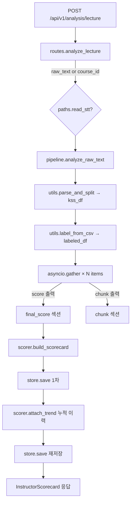

# LectureInsight Backend (v2)

강사의 STT 강의 스크립트를 분석해 **18개 체크리스트 항목별 평가 + 시계열 트렌드 리포트**를 자동 생성하는 분석 엔진.

## 한눈에 보는 구조

- **항목별 모듈 패턴**: 18개 평가 항목을 `app/preprocessing/itemNN_*.py`(데이터 가공·정량 채점)와 `app/analysis/itemNN_*.py`(LLM 채점)로 쪼개 모듈화. 새 항목 추가 = `pipeline._ITEMS` 한 줄.
- **공유 입력 2종**: `kss`(KSS 문장 분리 결과) · `labeled`(개념/예시/실습으로 라벨링된 청크). 강의 1편당 1회만 생성하고 모든 항목이 재사용.
- **출력 2종**: `score`(최종 점수 1~5) · `chunk`(LLM 입력용 청크만, 채점은 위임).
- **비동기 18병렬**: `asyncio.gather` 로 항목 모듈을 동시 실행. Gemini 호출은 항목 내부에서 `Semaphore(concurrency)` 로 동시성 제어.

## Stack

- **Framework**: FastAPI(API) + Streamlit(대시보드)
- **LLM**: Google Gemini (`gemini-2.5-flash`, `temperature=0.2`, `response_mime_type="application/json"`)
- **NLP**: Kiwi(kiwipiepy, 문장 분리·형태소·EF/EC 완결성), KSS(공유 입력의 문장 분리), 정규식
- **Data**: pandas, numpy, pydantic v2
- **Async**: asyncio + Semaphore (Gemini 동시성 제어)
- **Visualization**: matplotlib, plotly
- **Report**: Jinja2(HTML), python-docx(DOCX)
- **영속화**: 파일 시스템 JSON (`data/processed/scorecards/`) — DB 미도입
- **Logs**: loguru

## Project Layout

```
backend/
├── app/
│   ├── api/routes/
│   │   ├── analysis.py          # POST /lecture, /batch, GET /instructor/{id}
│   │   ├── report.py            # POST /generate, GET /download/{file_id}
│   │   └── health.py
│   ├── core/
│   │   ├── config.py            # Pydantic Settings (.env)
│   │   ├── checklist.py         # ChecklistItem 정의 (configs/checklist.yaml 로더)
│   │   ├── paths.py             # configs/paths.yaml 로 외부 STT 경로 해석
│   │   └── store.py             # InstructorScorecard 파일 영속화 (DB 도입 전)
│   ├── preprocessing/
│   │   ├── utils.py             # ★ 공통 인프라: parse_and_split / label_from_csv,
│   │   │                        #   시간축 보정, 키워드/컨텍스트 윈도우, 루브릭 변환
│   │   ├── sentencizer.py       # Kiwi 문장화 + EF/EC 완결성 (항목 2,3 의존)
│   │   ├── noun_extractor.py    # 명사 추출 (키워드 파이프라인 입력)
│   │   ├── keyword_pipeline.py  # 키워드 집계 파이프라인
│   │   ├── preprocessor.py      # (보조) STT 파싱
│   │   ├── eda.py               # 보조 통계
│   │   ├── question.py          # 학생 Q-A 페어 추출 → chunk 출력
│   │   ├── summary.py           # 마무리 요약 chunk 출력
│   │   ├── error_handling.py    # 오류 대응 — 직접 score
│   │   ├── sequence_violation.py# 설명 순서 위반 — 직접 score
│   │   ├── item02_completeness.py
│   │   ├── item03_consistency.py
│   │   ├── item04_learning_objectives.py
│   │   ├── item05_review_linkage.py
│   │   ├── item09_concept_definition.py
│   │   ├── item10_example_coverage.py
│   │   ├── item12_pace.py
│   │   ├── item13_example_relevance.py
│   │   ├── item16_comprehension_check.py
│   │   └── item17_engagement.py
│   ├── analysis/
│   │   ├── pipeline.py          # ★ 18 항목 비동기 오케스트레이터 (_ITEMS 레지스트리)
│   │   ├── rubric_llm.py        # ★ Gemini 호출 + 항목 YAML 프롬프트 로더
│   │   ├── schemas.py           # Utterance / Sentence / InstructorScorecard 등
│   │   ├── scorer.py            # 카테고리 가중 평균 + 트렌드 + 주차 집계
│   │   ├── item04_learning_objectives.py
│   │   ├── item05_review_linkage.py
│   │   ├── item09_concept_definition.py
│   │   ├── item10_example_coverage.py
│   │   ├── item13_example_relevance.py
│   │   ├── 07_emphasis.py       # ⚠ item 접두사 누락 (네이밍 정리 대상)
│   │   ├── 11_prerequisite.py   # ⚠
│   │   ├── 14_practice_link.py  # ⚠
│   │   ├── emphasis_checker.py
│   │   ├── prompts/
│   │   │   └── items/           # itemNN_*.yaml (항목별 system + user_template)
│   │   └── (analyzer.py / embedder.py / behavior_tagger.py / ensemble.py
│   │        / templates.py — v2 초안의 stub, 미사용)
│   ├── report/
│   │   ├── report_generator.py  # OUTPUT_ROOT, generate(scorecard, formats)
│   │   ├── charts.py            # 레이더 / 추이 차트
│   │   ├── html.py              # Jinja2
│   │   └── docx.py              # python-docx
│   ├── dashboard/
│   │   └── app.py               # Streamlit (분석 실행 / 이력 / 리포트 다운로드)
│   ├── main.py                  # FastAPI 부트스트랩
│   ├── models/                  # placeholder
│   └── utils/                   # placeholder
├── configs/
│   ├── checklist.yaml           # 18 항목 메타 + 카테고리 가중치
│   ├── kiwi_user_dict.yaml      # Kiwi 사용자 사전
│   ├── paths.example.yaml       # paths.yaml 템플릿
│   ├── paths.yaml               # ★ 외부 STT 경로 (gitignore 권장)
│   ├── bow_indicators.yaml      # (초안 잔존, 사용 안 함)
│   └── few_shot_examples.yaml   # (초안 잔존, 사용 안 함)
├── data/                        # 원본/처리 데이터 (gitignore)
│   ├── raw/                     # STT 원본 .txt
│   └── processed/
│       ├── *_kss.csv            # parse_and_split 결과 (문장 분리)
│       ├── *_labeled.json       # label_from_csv 결과 (개념/예시/실습 청크)
│       └── scorecards/          # store.py 가 저장한 InstructorScorecard
├── outputs/                     # 생성 리포트 (gitignore)
├── notebooks/                   # 항목별 EDA, 라벨 검토 등
├── tests/                       # 항목별 단위 테스트
├── pyproject.toml
└── .env.example
```

## Setup — 조원용 실행 가이드

> 권장: **conda 전용 환경**. `mecab`·`sentence-transformers` 는 **선택**(없어도 동작, 자동 폴백/스킵).
> 필수 준비물: Gemini API 키(`.env` 의 `API_KEY`).

### 1. 백엔드 실행

```bash
# 1) conda 전용 환경 (base 오염 방지)
conda create -n lectureinsight python=3.11 -y
conda activate lectureinsight

# 2) 의존성 설치 (pyproject 기반, editable)
cd backend
pip install -e .                  # 기본 — KSS=pecab 폴백, item14(KR-SBERT) 자동 스킵
# pip install -e ".[embeddings]"  # 선택 — item14 실습연계 채점까지(torch 동반, 무거움)

# 3) 환경 변수
cp .env.example .env                               # API_KEY(Gemini) 입력
cp configs/paths.example.yaml configs/paths.yaml   # (선택) 외부 STT 파일 경로

# 4) 서버 실행
uvicorn app.main:app --reload --port 8000 --no-access-log
#   → http://localhost:8000/health 가 {"status":"ok"} 면 성공
#   (--no-access-log: 프론트 폴링 GET 로그 도배 방지)
```

### 2. (선택) KSS 문장분리 속도 — mecab

긴 강의는 기본 백엔드 `pecab`(순수 파이썬)이 느립니다(분 단위). mecab을 깔면 초 단위로 빨라집니다.

```bash
brew install mecab-ko mecab-ko-dic        # 충돌 시: brew unlink mecab 후 재시도
pip install mecab-python3
# Apple Silicon konlpy/mecab 경로 문제 → env 에 MECABRC 박아두기
conda env config vars set MECABRC=/opt/homebrew/etc/mecabrc -n lectureinsight
conda deactivate && conda activate lectureinsight   # 재활성화로 적용
```
미설치 시 자동으로 pecab 폴백(동작은 정상, 느릴 뿐). **OS 의존이라 `pip install -e .` 만으론 재현 안 됨** — 머신마다 위 단계 필요.

### 3. 프론트엔드 실행 (별도 터미널)

```bash
cd frontend
npm install
cp .env.example .env.local        # NEXT_PUBLIC_API_BASE_URL=http://localhost:8000
npm run dev                       # → http://localhost:3000
```

### 4. CLI 단독 실행 (FastAPI 없이 파이프라인만)

```bash
python -m app.analysis.pipeline data/raw/2026-02-02_kdt-backendj-21th.txt -c 5
```

## Architecture

### 책임 경계 — preprocessing vs analysis

| 디렉토리 | 책임 |
|---|---|
| **preprocessing/** | ① STT 파싱·문장 분리·시간축 정리 등 **공통 입력 인프라**. ② 항목별 **데이터 가공**: LLM 채점이 필요하면 `chunk` 만 만들고 analysis에 위임, 정량 계산만으로 끝나는 항목은 **직접 score 산출**. |
| **analysis/** | ① **LLM 호출 추상화**(`rubric_llm.py`)와 항목 프롬프트 보관. ② 항목별 **LLM 채점 진입점**: 같은 이름의 preprocessing 모듈을 호출해 chunk를 받고 Gemini 채점. ③ **오케스트레이션**(`pipeline.py`)과 **점수 집계**(`scorer.py`). |

> 같은 항목이 두 디렉토리에 동시에 존재할 수 있습니다 — 예: `preprocessing/item04_learning_objectives.py` 가 도입부 30분 청크 생성, `analysis/item04_learning_objectives.py` 가 Gemini 호출·채점.

### 항목 모듈의 4가지 형태

`pipeline._ITEMS` 는 각 항목을 `(결과 키, 모듈, 입력 종류, 출력 종류)` 로 등록합니다.

|  | 입력 = `kss` (문장 분리만) | 입력 = `labeled` (개념/예시/실습 라벨) |
|---|---|---|
| 출력 = `score` (최종 점수) | item04, item05 (preprocessing 청크 → analysis LLM 채점) | item09, item10, item13, error_handling, sequence_violation |
| 출력 = `chunk` (LLM 입력만) | question, summary | — |

`score` 출력은 결과 dict 의 `final_score` 섹션, `chunk` 출력은 `chunk` 섹션에 모입니다.

### 단일 강의 분석 흐름 (`POST /api/v1/analysis/lecture` → `pipeline.run`)

```
┌────────────────────────────────────────────────────────────────────┐
│ STT 텍스트 (raw_text 또는 paths.yaml + course_id 로 외부 파일 로드)  │
└────────────────────────────────────┬───────────────────────────────┘
                                     │
                ┌────────────────────▼────────────────────┐
                │ utils.parse_and_split()                  │
                │  - STT 파싱 (<HH:MM:SS> id: text)        │
                │  - KSS 문장 분리                          │
                │  - 시간축 보정 (sec_raw → sec_fixed →    │
                │    elapsed_sec → duration_sec)           │
                │  - 쉬는 시간 경계 탐지 (break_time)       │
                │  → data/processed/<stem>_kss.csv         │
                └────────────────────┬────────────────────┘
                                     │ kss_df
                ┌────────────────────▼────────────────────┐
                │ utils.label_from_csv()                   │
                │  - 정규식으로 개념/예시/실습 1차 탐지       │
                │  - 앵커 창 병합                           │
                │  - Gemini 로 청크 라벨 확정               │
                │  → data/processed/<stem>_labeled.json    │
                └────────────────────┬────────────────────┘
                                     │ labeled_df
                                     │
   ┌─────────────────────────────────┴─────────────────────────────┐
   │     pipeline._run_all  (asyncio.gather, 항목당 1 태스크)          │
   │                                                                │
   │  ┌──────────────┐ ┌──────────────┐ ┌──────────────┐ ┌──────┐   │
   │  │ item04       │ │ item09       │ │ question     │ │ ...  │   │
   │  │ (kss/score)  │ │ (labeled/    │ │ (kss/chunk)  │ │      │   │
   │  │              │ │  score)      │ │              │ │      │   │
   │  │ 1. preproc.  │ │ 1. preproc.  │ │ 1. preproc.  │ │      │   │
   │  │    item04.run│ │    item09.run│ │    question. │ │      │   │
   │  │ 2. rubric_llm│ │ 2. rubric_llm│ │    run(df)   │ │      │   │
   │  │    → Gemini  │ │    → Gemini  │ │              │ │      │   │
   │  │ 3. _score()  │ │ 3. _score()  │ │              │ │      │   │
   │  └──────┬───────┘ └──────┬───────┘ └──────┬───────┘ └──────┘   │
   └─────────┼────────────────┼────────────────┼────────────────────┘
             │                │                │
             ▼                ▼                ▼
         {final_score}    {final_score}    {chunk}
                                     │
                ┌────────────────────▼────────────────────┐
                │ pipeline.run 반환 dict                    │
                │  {                                       │
                │    "evaluated_at": ...,                  │
                │    "source": "<filename>",               │
                │    "final_score": { item: {...}, ... },  │
                │    "chunk":       { item: {...}, ... },  │
                │  }                                       │
                └────────────────────┬────────────────────┘
                                     │
                ┌────────────────────▼────────────────────┐
                │ scorer.build_scorecard / attach_trend    │
                │  (카테고리 가중 평균 + 시계열 회귀)         │
                └────────────────────┬────────────────────┘
                                     │ InstructorScorecard
                ┌────────────────────▼────────────────────┐
                │ store.save  → JSON 영속화               │
                │ (data/processed/scorecards/...)         │
                └────────────────────┬────────────────────┘
                                     │
                                     ▼  JSON 응답 / Streamlit 렌더 / 리포트 생성
```

### Mermaid: API 진입점 시퀀스



### 리포트 생성 흐름 (`POST /api/v1/report/generate`)

```mermaid
flowchart TD
    R1[scorecard_id or scorecard] --> R2{store.get?}
    R2 --> R3[report_generator.generate]
    R3 --> R4[charts.radar_chart / trend_chart]
    R4 --> R5{formats?}
    R5 -->|html| R6[html.render → Jinja2 + base64 차트]
    R5 -->|docx| R7[docx.render → python-docx]
    R6 --> R8[outputs/{instructor}/{date}.html]
    R7 --> R9[outputs/{instructor}/{date}.docx]
    R8 --> R10[GET /download/{file_id} → FileResponse]
    R9 --> R10
```

### 데이터 흐름 (Pydantic / dict 기준)

```
raw_text (str)
   ↓ utils.parse_and_split
kss_df (DataFrame: lecture_id, date, timestamp, speaker_id, text_raw,
                   sec_raw, sec_fixed, elapsed_sec, duration_sec, break_time)
   ↓ utils.label_from_csv
labeled_df (DataFrame: file, anchor_dt, anchor_label, anchor_text,
                       n_merged, n_utterances, text,
                       llm_label, llm_reason, llm_key_sentence)
   ↓ pipeline._run_all (item modules)
{ final_score: { item: {evidence, reason, final_score:1~5}, ... },
  chunk:       { item: {chunk: str}, ... } }
   ↓ scorer.build_scorecard + attach_trend
InstructorScorecard {
  instructor_id, lecture_date, overall_score,
  category_scores, item_scores,
  trend_slope, trend_label, trend_points
}
   ↓ store.save → data/processed/scorecards/{instructor}/{date}.json
   ↓ report_generator.generate → outputs/.../*.{html,docx}
```

> **2026-06 추가**: `scorer.build_scorecard` 직후 `explainer.attach_explanations(card)` 가
> 항목별 자연어 해설을 채운다. 강의 종합 분석은 별도 엔드포인트
> `POST /api/v1/analysis/narrative` 로 생성한다(아래 참고).

## 항목별 해설 · 종합 분석 (LLM, 2026-06)

점수(structured)는 그대로 두고 그 위에 **표현 레이어(자연어)** 를 얹는다 — 감사·재현성 유지.

### 항목별 해설 — `analysis/explainer.py`
- `analyze_raw_text` 안에서 `build_scorecard` 직후 **Gemini 1회**로 전 항목을 한 번에 처리.
- 항목 표 '해설' 칸 = **2줄 형식**:
  - **1줄 (`reason`)**: 핵심 한 줄 코멘트 — 고득점=잘한 점 / 저득점=개선 방향.
  - **2줄 (`evidence`, "근거")**: 지표·판정 근거 한 줄(긴 CoT는 자동 압축 — 표시 90자 / explainer 입력 240자 제한).
- `strengths`/`improvements` 는 하단 '최종 피드백' 카드용. 어조는 추정형(완곡).
- `ItemScore.reason` 필드 신설(1줄 코멘트).

### 종합 분석 + 요약 — `analysis/narrative.py` + `POST /api/v1/analysis/narrative`
- 흐름: (1) **종합 분석**(`overall_feedback`, 2~3단락) 생성 → (2) 그 **요약**(`summary`).
- **톤 구분**: 단일 강의 = '이번 강의' / 입력 파일 종합(aggregate) = '이 강사 전반'.
- 종합 뷰는 프론트(`buildAggregate`)가 계산 → 단일/종합 모두 이 엔드포인트를 **온디맨드** 호출.
- 요청 `{ scorecard, is_aggregate, lecture_count }` → 응답 `{ overall_feedback, summary }`.

### 채점 근거 grounding — `analysis/rubrics.py` + `configs/item_rubrics.yaml`
- 18항목 세부 기준 + 고/저득점 의미를 explainer·narrative 프롬프트에 주입해 해설을 채점 기준에 정합.

## 18개 체크리스트 항목

`configs/checklist.yaml` 의 메타와 실제 구현 상태를 함께 표기합니다.
**현재 `pipeline._ITEMS` 에 18개 전부 등록.** 단, 일부는 **조건부 동작**:
- **item07(핵심 강조)**: `data/processed/keywords.json`(KeyBERT 전처리 산출, `python -m app.preprocessing.keyword_pipeline`) 필요 → 없으면 `N/A`.
- **item11(선행 개념)·item14(실습 연계)**: KR-SBERT 필요 → `[embeddings]` 미설치 시 런타임 자동 스킵.
- 입력 종류는 `kss` / `labeled` / `sentences`(항목 2·3) / `txt_path`(원본 STT 직접 파싱: 항목 1·7·11) 4종.

| ID | 항목 | 카테고리 | 유형 | preprocessing | analysis | 채점 방식 | 비고 |
|---|---|---|---|---|---|---|---|
| 1 | 불필요한 반복 표현 | language | high_inference | — | — | — | 미구현 |
| 2 | 발화 완결성 | language | high_inference | `item02_completeness` | — | 정량(EF/EC) | sentencizer 의존 |
| 3 | 언어 일관성 | language | high_inference | `item03_consistency` | — | 정량 | |
| 4 | 학습 목표 안내 | structure | discrete | `item04_learning_objectives` | `item04_learning_objectives` | LLM | intro 30분 chunk |
| 5 | 전날 복습 연계 | structure | discrete | `item05_review_linkage` | `item05_review_linkage` | LLM | |
| 6 | 설명 순서 | structure | high_inference | `sequence_violation` | — | 정량 | labeled 기반 |
| 7 | 핵심 강조 | structure | high_inference | — | `07_emphasis` + `emphasis_checker` | LLM | ⚠ item 접두사 누락 |
| 8 | 마무리 요약 | structure | discrete | `summary` | — | (chunk만) | 채점 모듈 미구현 |
| 9 | 개념 정의 | concept | high_inference | `item09_concept_definition` | `item09_concept_definition` | LLM | labeled |
| 10 | 비유/예시 활용 | concept | high_inference | `item10_example_coverage` | `item10_example_coverage` | LLM | labeled |
| 11 | 선행 개념 확인 | concept | high_inference | — | `11_prerequisite` | LLM | ⚠ item 접두사 누락 |
| 12 | 발화 속도 적절성 | concept | high_inference | `item12_pace` | — | 정량 | duration_sec 활용 |
| 13 | 예시 적절성 | practice | high_inference | `item13_example_relevance` | `item13_example_relevance` | LLM | labeled |
| 14 | 실습 연계 | practice | high_inference | — | `14_practice_link` | LLM | ⚠ item 접두사 누락 |
| 15 | 오류 대응 | practice | high_inference | `error_handling` | — | 정량 | labeled |
| 16 | 이해 확인 질문 | interaction | discrete | `item16_comprehension_check` | — | 정량 | 키워드 + 정량 |
| 17 | 참여 유도 | interaction | discrete | `item17_engagement` | — | 정량 | |
| 18 | 질문 응답 충분성 | interaction | discrete | `question`(Q-A 추출) | — | (chunk만) | 채점 모듈 미구현 |

### 카테고리 가중치

| 카테고리 | 가중치 |
|---|---|
| structure | 25% |
| concept | 25% |
| practice | 20% |
| language | 15% |
| interaction | 15% |

## 새 평가 항목 추가하기

1. `app/preprocessing/itemNN_<name>.py` 작성 — `run(df) -> {"chunk": str}` 또는 `run(df) -> {"final_score": int, "reason": str, "evidence": ...}`
2. LLM 채점이 필요하면 `app/analysis/itemNN_<name>.py` 작성 — preprocessing의 `run(df)` 으로 chunk를 받고 `rubric_llm.judge()` 호출
3. LLM 프롬프트가 필요하면 `app/analysis/prompts/items/itemNN_<name>.yaml` 추가 (`system`, `user_template`)
4. `app/analysis/pipeline.py:_ITEMS` 에 한 줄 추가:
   ```python
   ("<key>", <module>, "kss"|"labeled", "score"|"chunk"),
   ```
5. `configs/checklist.yaml` 의 18 항목 메타와 동기화 (현재 메타와 코드 등록이 어긋날 수 있음)

## 환경 변수

```ini
API_KEY=...                          # Gemini
LLM_MODEL=gemini-2.5-flash
LLM_TEMPERATURE=0.2
APP_HOST=0.0.0.0                     # uvicorn 바인드
APP_HOST_PUBLIC=localhost            # 브라우저 접속용
APP_PORT=8000
DASHBOARD_PORT=8501
CORS_ORIGINS=http://localhost:3000,http://localhost:8501
```

## 외부 데이터 경로 (`configs/paths.yaml`)

STT 원본/메타데이터는 보안상 repo 밖에 두고 경로만 참조합니다.

```yaml
data:
  stt_dir: /절대/경로/to/stt
  metadata_csv: /절대/경로/to/metadata.csv
stt_filename_pattern: "{date}_{course_id}.txt"
```

## 영속화

- DB 없음. `app/core/store.py` 가 `data/processed/scorecards/{instructor_id}/{lecture_date}.json` 로 InstructorScorecard 를 저장.
- 강사 누적 조회·트렌드 회귀는 폴더 글로브 + 정렬로 수행 (`store.list_by_instructor`).
- DB 도입은 데이터 규모/검색 요구가 커지는 시점의 후속 작업.

### 정리 대상 (미사용/구식 파일)

다음은 초안의 잔존물로, 정리 또는 deprecated 표기가 필요합니다.

- `app/analysis/analyzer.py`, `embedder.py`, `behavior_tagger.py`, `ensemble.py`, `templates.py` — placeholder, 코드 흐름 미사용
- `configs/bow_indicators.yaml`, `configs/few_shot_examples.yaml` — 미사용
- `app/analysis/prompts/system.yaml`, `prompts/items/01_repetition.yaml`, `04_learning_goal.yaml` — 새 `itemNN_*.yaml` 패턴으로 대체
- `app/analysis/07_emphasis.py`, `11_prerequisite.py`, `14_practice_link.py` — `item07_*.py` 등으로 명명 통일 필요
- `configs/checklist.yaml` ↔ `pipeline._ITEMS` 동기화 필요 (메타와 코드 등록 항목이 부분적으로 어긋남)

## 보안 / 운영 메모

- 실 강의 데이터는 절대 커밋 금지 (`data/`, `outputs/`, `configs/paths.yaml` 모두 gitignore 권장)
- API 키는 `.env` 로만 관리, 코드에 하드코딩 금지
- Gemini thinking-token 이 `max_output_tokens` 를 잠식하므로 출력 토큰 한도를 두지 않음 (`rubric_llm.judge` 주석 참고)
- LLM 호출 동시성은 `concurrency` 파라미터(`pipeline.run(..., concurrency=10)`)로 제어

## 참고 논문 (설계 초안 근거)

1. Göllner et al. (2025). *Revealing teaching quality through lesson semantics: A GPT-assisted analysis of transcripts*. BJEP.
2. *Analyzing Large Language Models for Classroom Discussion Assessment*. EDM 2024.
3. *Automated Evaluation of Classroom Instructional Support with LLMs and BoWs*. arXiv:2310.01132.
4. *The Promises and Pitfalls of Using Language Models to Measure Instruction Quality in Education*. arXiv:2404.02444.
5. *Leveraging Lecture Content for Improved Feedback: Explorations with GPT-4 and RAG*. ResearchGate 2024.
6. *Large Language Model-Powered Automated Assessment: A Systematic Review*. MDPI 2024.
7. *AI-based teaching evaluations: How well do they reflect student perceptions?*. C&E AI 2025.

> 위 논문은 v2 초안의 RAG/BoW/앙상블 설계 근거입니다. 현재 구현은 그 중 일부(루브릭 명시화, temperature 0.2, discrete vs high_inference 구분 의도)만 살아 있고, RAG/BoW/앙상블은 제외되었습니다.
