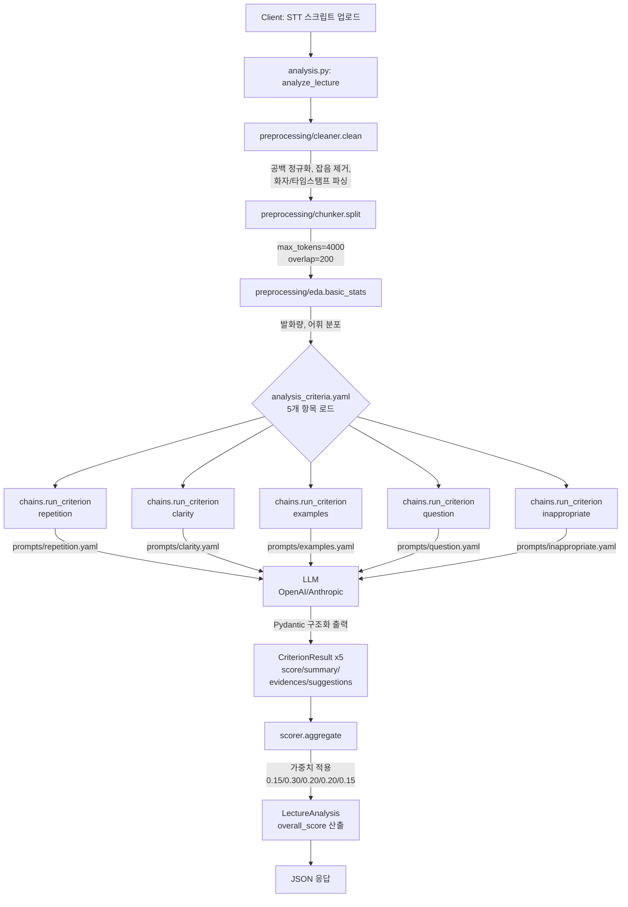
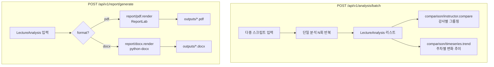

# LectureInsight Backend

강의 스크립트(STT)를 분석해 강사별 강의력 리포트를 생성하는 분석 엔진 API.

## Stack

- **Framework**: FastAPI
- **LLM**: OpenAI GPT-4o / Claude API
- **NLP**: LangChain, KoNLPy, NLTK, pandas
- **Report**: ReportLab (PDF), python-docx (DOCX)

## Project Layout

```
app/
├── api/routes/        # FastAPI 엔드포인트
├── core/              # 설정, 로깅
├── preprocessing/     # 텍스트 정제, 청크 분할, EDA
├── analysis/          # LLM 분석 엔진 (체인, 프롬프트, 스코어링)
│   └── prompts/       # 항목별 프롬프트 (YAML)
├── comparison/        # 강사 비교, 시계열 분석
├── report/            # PDF/DOCX 리포트 생성
├── models/            # Pydantic 데이터 모델
└── utils/
configs/               # 분석 기준, 가중치
data/                  # 원본/처리 데이터 (gitignore)
outputs/               # 생성 리포트 (gitignore)
notebooks/             # EDA, 프롬프트 실험
tests/
```

## Setup

```bash
python -m venv .venv
source .venv/bin/activate
pip install -e .
cp .env.example .env   # API 키 입력
uvicorn app.main:app --reload
```

## Architecture

### 전체 구조 (Layer View)

```
┌──────────────────────────────────────────────────────────────┐
│                       Client (Frontend)                       │
└──────────────────────────────────────────────────────────────┘
                              │  HTTP / JSON
                              ▼
┌──────────────────────────────────────────────────────────────┐
│  API Layer  (app/api/routes/)                                 │
│  ├─ health.py          GET  /health                           │
│  ├─ analysis.py        POST /api/v1/analysis/lecture          │
│  │                     POST /api/v1/analysis/batch            │
│  │                     GET  /api/v1/analysis/instructor/{id}  │
│  └─ report.py          POST /api/v1/report/generate           │
│                        GET  /api/v1/report/compare            │
└──────────────────────────────────────────────────────────────┘
                              │
        ┌─────────────────────┼─────────────────────┐
        ▼                     ▼                     ▼
┌────────────────┐   ┌─────────────────┐   ┌─────────────────┐
│ Preprocessing  │──▶│   Analysis      │──▶│   Scorer        │
│ (전처리)        │   │  (LLM 체인)      │   │  (점수 집계)     │
│ • cleaner      │   │ • chains.py     │   │ • aggregate()   │
│ • chunker      │   │ • prompts/*.yml │   │   ← weights     │
│ • eda          │   │ • schemas.py    │   │     (yaml)      │
└────────────────┘   └─────────────────┘   └─────────────────┘
                                                    │
                          ┌─────────────────────────┼─────────────────────┐
                          ▼                         ▼                     ▼
                ┌──────────────────┐   ┌─────────────────────┐  ┌──────────────────┐
                │   Comparison     │   │       Report        │  │  JSON Response   │
                │ • instructor.py  │   │ • pdf.py (ReportLab)│  │  (LectureAnalysis│
                │ • timeseries.py  │   │ • docx.py           │  │   Pydantic)      │
                └──────────────────┘   └─────────────────────┘  └──────────────────┘
                                                    │
                                                    ▼
                                            outputs/*.pdf|.docx

┌──────────────────────────────────────────────────────────────┐
│  Core / Config                                                │
│  • core/config.py  (Pydantic Settings, .env 로드)             │
│  • configs/analysis_criteria.yaml (5개 항목 + 가중치)          │
│  • LLM_PROVIDER: openai | anthropic                           │
└──────────────────────────────────────────────────────────────┘
```

### 단일 강의 분석 플로우 (`POST /api/v1/analysis/lecture`)



### 배치 / 리포트 플로우



### 데이터 흐름 요약 (Pydantic 스키마 기준)

```
raw_text (str)
    ↓ cleaner.clean
cleaned_text (str)
    ↓ chunker.split
chunks (list[str])
    ↓ analysis.chains.run_criterion × 5개 항목
CriterionResult { criterion, score, summary, evidences[], suggestions[] }
    ↓ scorer.aggregate (+ weights)
LectureAnalysis { lecture_id, instructor_id, criteria[], overall_score }
    ↓ ── report.render → PDF/DOCX
    └── comparison.compare/trend → 강사 비교/추이 (배치 시)
```

## Notes

- 실제 강의 데이터는 절대 커밋 금지 (`data/`, `outputs/` 모두 gitignore)
- API 키는 `.env`로만 관리, 절대 코드에 하드코딩 금지
