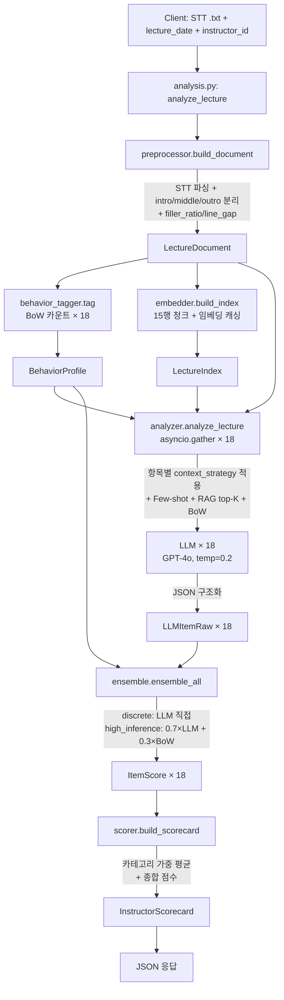
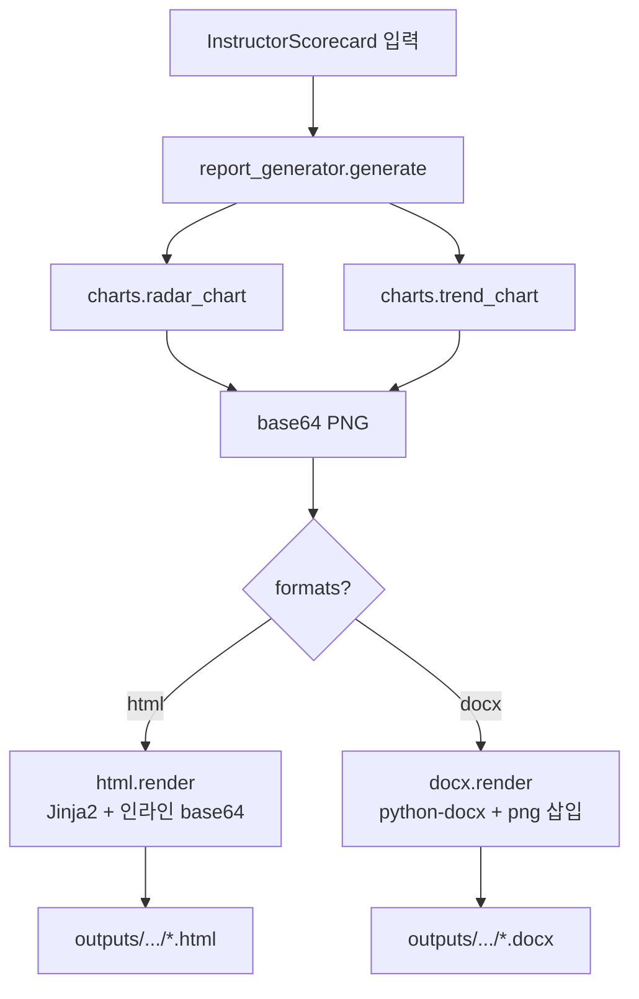

# LectureInsight Backend (v2)

강사의 STT 강의 스크립트를 **RAG + BoW 앙상블** 로 분석하여
**18개 체크리스트 항목별 평가 + 개선 제언 + 시계열 트렌드 리포트**를 자동 생성하는 분석 엔진.

> v2 변경 요약 — 단순 LLM 채점(5항목) → 다신호 앙상블(18항목) 으로 전면 개편
>
> | 영역 | v1 | v2 |
> |---|---|---|
> | 평가 항목 | 5개 (균등 구조) | **18개** (5 카테고리 + discrete/high_inference 구분) |
> | 컨텍스트 | 청크 분할 후 일괄 LLM | **RAG 검색** (의미 기반 top-K 청크) |
> | 신호원 | LLM 단독 | **LLM + BoW + Few-shot** 앙상블 |
> | 신뢰도 | 점수만 | **confidence 필드 + 인간 검토 표시** |
> | 출력 | PDF/DOCX | **HTML(차트 인라인) + DOCX + Streamlit 대시보드** |
> | 시계열 | placeholder | **선형 회귀 트렌드 판별** |

## Stack

- **Framework**: FastAPI (API) + Streamlit (대시보드)
- **LLM**: OpenAI GPT-4o (`temperature=0.2`)
- **Embedding**: OpenAI `text-embedding-3-small` (캐싱)
- **NLP**: KoNLPy, NLTK, scikit-learn (코사인 유사도, 선형 회귀)
- **Data**: pandas, numpy, pydantic v2
- **Async**: asyncio + tenacity (18항목 병렬, 자동 재시도)
- **Visualization**: matplotlib, plotly
- **Report**: Jinja2 (HTML), python-docx (DOCX)
- **Logs**: loguru

## Project Layout

```
backend/
├── app/
│   ├── api/routes/              # FastAPI 엔드포인트
│   │   ├── analysis.py          # POST /lecture, /batch, GET /instructor/{id}
│   │   ├── report.py            # POST /generate, GET /download/{id}
│   │   └── health.py
│   ├── core/
│   │   ├── config.py            # Pydantic Settings (.env 로드)
│   │   └── checklist.py         # ChecklistItem / ItemType / ContextStrategy
│   ├── preprocessing/
│   │   ├── preprocessor.py      # STT 파싱 + intro/middle/outro 분리
│   │   └── eda.py               # filler_word_ratio, avg_line_gap (BoW 입력)
│   ├── analysis/
│   │   ├── schemas.py           # 파이프라인 단계별 Pydantic 모델
│   │   ├── behavior_tagger.py   # 2-A: BoW 행동 태깅 (Paper #3)
│   │   ├── embedder.py          # 2-B: 임베딩 + RAG 검색 (Papers #1, #5)
│   │   ├── templates.py         # 프롬프트 조립 (system + item + few-shot + RAG + BoW)
│   │   ├── analyzer.py          # 3: LLM 비동기 분석 (Paper #2)
│   │   ├── ensemble.py          # 4: discrete vs high_inference 결합 (Paper #4)
│   │   ├── scorer.py            # 5: 카테고리 가중 평균 + 시계열 회귀
│   │   └── prompts/
│   │       ├── system.yaml      # 공통 루브릭
│   │       └── items/           # 18개 항목별 프롬프트 (id_name.yaml)
│   ├── report/
│   │   ├── report_generator.py  # 6: 통합 진입점
│   │   ├── charts.py            # 레이더 / 추이 차트
│   │   ├── html.py              # Jinja2 HTML
│   │   └── docx.py              # python-docx
│   ├── dashboard/
│   │   └── app.py               # 7: Streamlit 대시보드
│   ├── models/                  # 공용 데이터 모델 placeholder
│   ├── utils/
│   └── main.py                  # FastAPI 진입점
├── configs/
│   ├── checklist.yaml           # 18개 항목 메타 + 카테고리 가중치 + 구간 분리
│   ├── bow_indicators.yaml      # 항목별 긍정/부정 키워드 사전
│   └── few_shot_examples.yaml   # 항목별 good/bad 예시 (Paper #2)
├── data/                        # 원본/처리 데이터 (gitignore)
│   ├── raw/                     # STT 원본 .txt
│   ├── processed/embeddings/    # 임베딩 캐시 (date별 .json)
│   └── metadata/                # 메타데이터 CSV
├── outputs/                     # 생성 리포트 (gitignore)
├── notebooks/                   # EDA, 프롬프트 실험
├── tests/
├── pyproject.toml
└── .env.example
```

## Setup

```bash
python -m venv .venv
source .venv/bin/activate
pip install -e .
cp .env.example .env              # OPENAI_API_KEY 입력

# API 서버
uvicorn app.main:app --reload

# Streamlit 대시보드 (별도 터미널)
streamlit run app/dashboard/app.py
```

## Architecture

### 1) 전체 파이프라인

```
┌─────────────────────────────────────────────────────────────────┐
│                         입력 데이터                              │
│  STT 스크립트 (.txt) + 메타데이터 (.csv) + 체크리스트 (.pdf)       │
└─────────────────────────┬───────────────────────────────────────┘
                          │
                   ┌──────▼──────┐
                   │  1단계       │
                   │ 전처리        │  preprocessor.py
                   │             │  - STT 파싱 (<HH:MM:SS> id: text)
                   │             │  - intro / middle / outro 구간 분리
                   │             │  - 보조 통계 (eda.py)
                   └──────┬──────┘
                          │ LectureDocument
              ┌───────────┼───────────┐
              │           │           │
       ┌──────▼─────┐     │     ┌─────▼──────┐
       │  2-A단계    │     │     │  2-B단계    │
       │ BoW 태깅    │     │     │ RAG 인덱싱   │
       │            │     │     │            │
       │behavior_   │     │     │embedder.py │  Papers #1, #5
       │tagger.py   │     │     │ - 15행 청크 │
       │            │     │     │ - 임베딩    │
       │ Paper #3   │     │     │ - 캐싱      │
       └──────┬─────┘     │     │ - 코사인검색 │
              │           │     └─────┬──────┘
              │BehaviorProfile        │ LectureIndex
              └───────────┬───────────┘
                          │
                   ┌──────▼──────┐
                   │  3단계       │
                   │ LLM 분석     │  analyzer.py
                   │             │  - RAG top-K 컨텍스트 주입
                   │             │  - BoW 카운트 프롬프트 주입
                   │             │  - Few-shot 예시 포함   Paper #2
                   │             │  - 18항목 비동기 병렬
                   │             │  - JSON 강제 (response_format)
                   └──────┬──────┘
                          │ LLMItemRaw × 18
                   ┌──────▼──────┐
                   │  4단계       │
                   │ 앙상블       │  ensemble.py            Paper #4
                   │             │  - discrete: LLM 직접
                   │             │  - high_inference:
                   │             │      LLM 70% + BoW 30%
                   │             │  - confidence 조정
                   └──────┬──────┘
                          │ ItemScore × 18
                   ┌──────▼──────┐
                   │  5단계       │
                   │ 스코어링      │  scorer.py
                   │             │  - 카테고리별 가중 평균
                   │             │  - 종합 점수
                   │             │  - 시계열 선형회귀(트렌드)
                   │             │  - 주차별 집계
                   └──────┬──────┘
                          │ InstructorScorecard
                   ┌──────▼──────┐
                   │  6단계       │
                   │ 리포트 생성    │  report_generator.py
                   │             │  - 레이더 차트 / 추이 차트
                   │             │  - HTML (Jinja2 + base64)
                   │             │  - DOCX (python-docx)
                   └──────┬──────┘
                          │
              ┌───────────▼───────────┐
              │   Streamlit 대시보드   │  app/dashboard/app.py
              │   - 분석 실행 / 결과 조회
              │   - 트렌드 시각화
              │   - 리포트 다운로드
              └───────────────────────┘
```

### 2) 단일 강의 분석 시퀀스 (`POST /api/v1/analysis/lecture`)



### 3) 리포트 생성 시퀀스 (`POST /api/v1/report/generate`)



### 4) 데이터 흐름 요약 (Pydantic 스키마 기준)

```
raw_text (str)
    ↓ preprocessor.build_document
LectureDocument { intro_lines, middle_lines, outro_lines, filler_ratio, line_gap }
    ↓ ┌── behavior_tagger.tag ── BehaviorProfile { items: {1..18: ItemBoW} }
      └── embedder.build_index ── LectureIndex { chunks: [IndexedChunk × N] }
    ↓ analyzer.analyze_lecture (asyncio × 18)
LLMItemRaw × 18 { score, evidence, strengths, improvements, confidence, used_chunk_ids }
    ↓ ensemble.ensemble_all
ItemScore × 18 { final_score, llm_score, bow_score, final_confidence, needs_human_review }
    ↓ scorer.build_scorecard (+ category_weights, + 선형회귀)
InstructorScorecard { overall_score, category_scores, item_scores, trend_slope, trend_label }
    ↓ report_generator.generate
outputs/*.html + outputs/*.docx
```

## 18개 체크리스트 항목

| ID | 항목명 | 카테고리 | 유형 | 컨텍스트 전략 |
|---|---|---|---|---|
| 1 | 불필요한 반복 표현 | language | high_inference | full_sample |
| 2 | 발화 완결성 | language | high_inference | full_sample |
| 3 | 언어 일관성 | language | high_inference | full_sample |
| 4 | 학습 목표 안내 | structure | **discrete** | intro |
| 5 | 전날 복습 연계 | structure | **discrete** | intro |
| 6 | 설명 순서 | structure | high_inference | full_sample |
| 7 | 핵심 강조 | structure | high_inference | middle |
| 8 | 마무리 요약 | structure | **discrete** | outro |
| 9 | 개념 정의 | concept | high_inference | middle |
| 10 | 비유/예시 활용 | concept | high_inference | middle |
| 11 | 선행 개념 확인 | concept | high_inference | intro |
| 12 | 발화 속도 적절성 | concept | high_inference | full_sample |
| 13 | 예시 적절성 | practice | high_inference | middle |
| 14 | 실습 연계 | practice | high_inference | keyword |
| 15 | 오류 대응 | practice | high_inference | keyword |
| 16 | 이해 확인 질문 | interaction | **discrete** | keyword |
| 17 | 참여 유도 | interaction | **discrete** | keyword |
| 18 | 질문 응답 충분성 | interaction | **discrete** | keyword |

**discrete (6개)** — 존재 여부 판단형. LLM 단독 사용 + confidence +0.10.
**high_inference (12개)** — 질적 판단형. `LLM 70% + BoW 30%` 앙상블, BoW 근거 부족 시 confidence × 0.85.

## 카테고리 가중치 (종합 점수)

| 카테고리 | 가중치 | 항목 수 |
|---|---|---|
| 강의 도입 및 구조 (structure) | 25% | 5 |
| 개념 설명 명확성 (concept) | 25% | 4 |
| 예시 및 실습 연계 (practice) | 20% | 3 |
| 언어 표현 품질 (language) | 15% | 3 |
| 수강생 상호작용 (interaction) | 15% | 3 |

## 핵심 설계 결정 (논문 근거)

| Paper | 인사이트 | v2 적용 |
|---|---|---|
| **#1** Göllner et al. (2025) | GPT 임베딩으로 의미 패턴 도출 → 강의 품질 분산 20% 설명 | `embedder.py` 15행 청크 임베딩 |
| **#2** EDM (2024) | Few-shot 예시로 정확도 10–15% ↑, 컨텍스트 길이 관리 핵심 | `templates.py` good/bad 예시, `RAG_TOP_K=5` |
| **#3** arXiv:2310.01132 | 발화 단위 BoW 행동 지표 + LLM 앙상블이 단독보다 안정적 | `behavior_tagger.py`, `ensemble.py` 7:3 |
| **#4** arXiv:2404.02444 | discrete vs high_inference 분리 처리 필수 | `ItemType` enum, ensemble 분기 |
| **#5** ResearchGate (2024) | RAG 주입으로 환각 감소, 강의 고유 용어 반영률 ↑ | `embedder.search()` 코사인 top-K |
| **#6** MDPI (2024) | 프롬프트 품질 + 낮은 temperature 가 점수 정확도 결정 | `LLM_TEMPERATURE=0.2`, 명시적 루브릭 |
| **#7** C&E AI (2025) | 분위기·공감 등 정성 항목은 텍스트만으론 한계 | `confidence < 0.5` → "인간 검토 권장" 표기 |

## 환경 변수

`.env.example` 참고. 주요 변수:

```
OPENAI_API_KEY=...
LLM_MODEL=gpt-4o
LLM_TEMPERATURE=0.2
EMBEDDING_MODEL=text-embedding-3-small
RAG_CHUNK_LINES=15
RAG_TOP_K=5
ENSEMBLE_LLM_WEIGHT=0.70
ENSEMBLE_BOW_WEIGHT=0.30
CONFIDENCE_THRESHOLD=0.5
```

## Notes

- **보안**: 실제 강의 데이터는 절대 커밋 금지 (`data/`, `outputs/` 모두 gitignore)
- **API 키**: `.env` 로만 관리, 코드에 하드코딩 금지
- **임베딩 캐시**: 동일 강의 재분석 시 `data/processed/embeddings/{date}.json` 재사용
- **LLM 캐시**: 동일 청크 + 동일 프롬프트 = 동일 응답 → `.cache/llm` 에 저장
- **인간 검토 표시**: 리포트에서 `confidence < 0.5` 항목은 "⚠ 인간 검토 권장" 으로 마킹

## 참고문헌

1. Göllner, R., Lazarides, R., & Stark, R. (2025). *Revealing teaching quality through lesson semantics: A GPT-assisted analysis of transcripts*. British Journal of Educational Psychology. https://doi.org/10.1111/bjep.70001
2. *Analyzing Large Language Models for Classroom Discussion Assessment*. EDM 2024. https://educationaldatamining.org/edm2024/proceedings/2024.EDM-short-papers.50/
3. *Automated Evaluation of Classroom Instructional Support with LLMs and BoWs*. arXiv:2310.01132. 2023.
4. *The Promises and Pitfalls of Using Language Models to Measure Instruction Quality in Education*. arXiv:2404.02444. 2024.
5. *Leveraging Lecture Content for Improved Feedback: Explorations with GPT-4 and RAG*. ResearchGate. 2024.
6. *Large Language Model-Powered Automated Assessment: A Systematic Review*. Applied Sciences (MDPI). 2024.
7. *AI-based teaching evaluations: How well do they reflect student perceptions?*. Computers and Education: AI. 2025.
